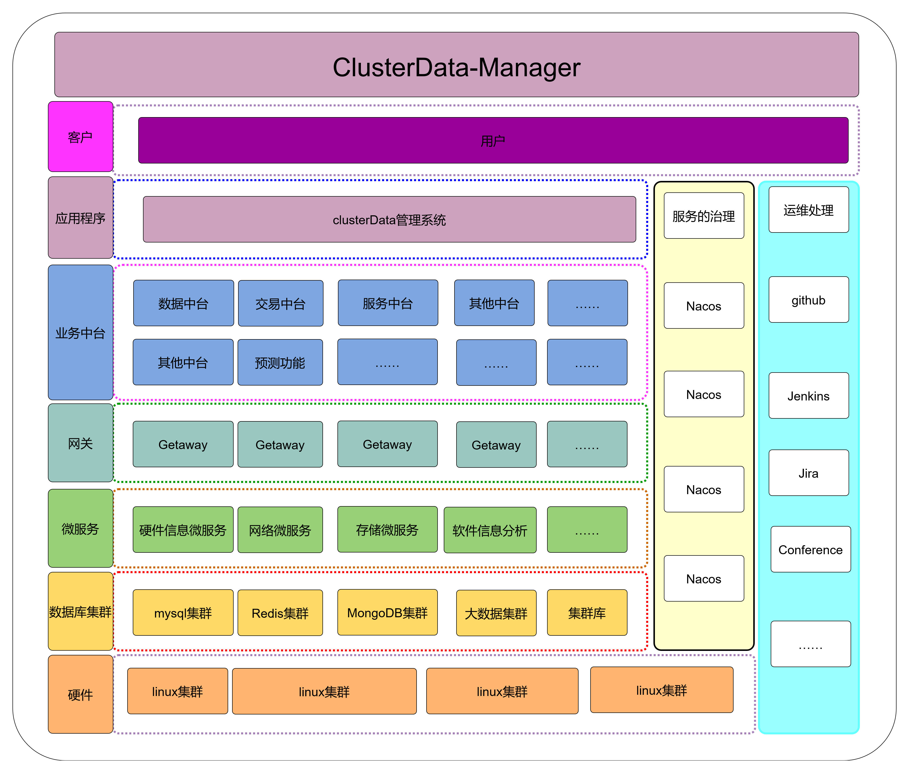
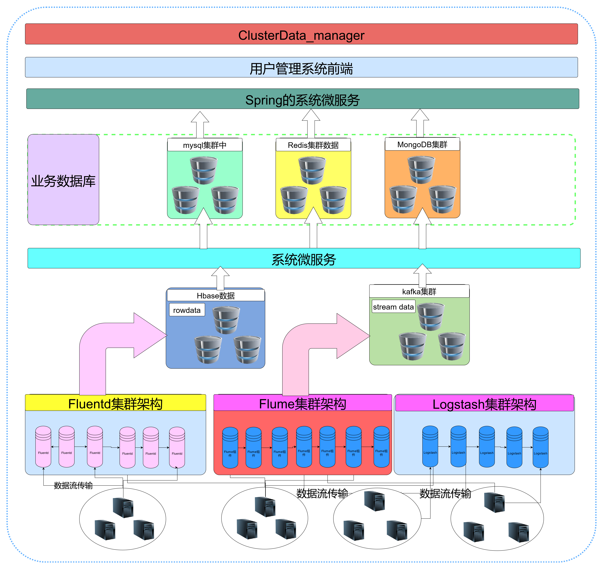

<h1 align="center"> ClusterData-Manager Project</h1>
-  针对于系统集群节点的管理，需要通过系统集群节点的底层获取日志数据来实现对集群节点的管理和监控，将集群节点的数据进行采集，通过利用大数据分析系统和神经网络的算法，实现对集群节点的预测以及系统扩容，缩容等业务的扩展。在整个系统中日志数据的采集对整个系统至关重要。因此本文讲详细介绍有关业界的常见的日志数据采集架构原理。通同时讲在个人github上建立一套完整的日志采集系统，供大家参考和学习，同时讲详细的讲述个人项目的整体架构和实现的原理。项目的原理框架图详细的介绍在：https://blog.csdn.net/weixin_41605937/article/details/119761349?spm=1001.2014.3001.5501

# ClusterDatade_Manager整体项目设计图
 

# ClusterDatade_Manager项目的数据流图
 

# ClusterDatade_Manager数据采集方案设计

# ClusterDatade_Manager数据库集群设计

# ClusterDatade_Manager项目的数据指标设计

# ClusterDatade_Manager微服务架构设计

# ClusterDatade_Manager项目的部署和运维设计
